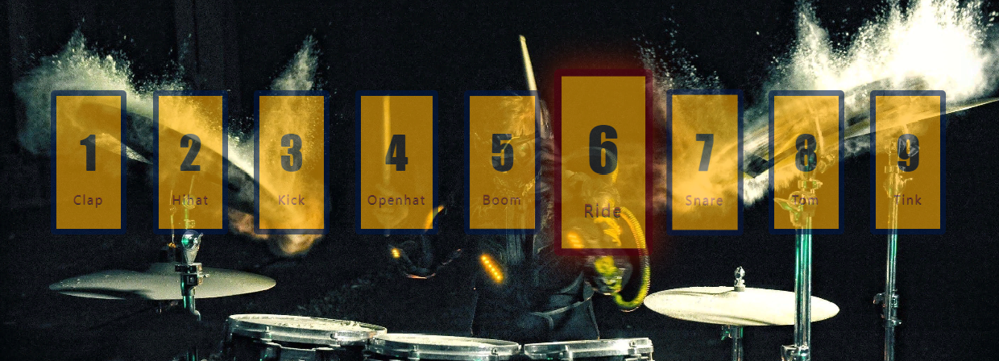

# JavaScript30-Vanilla-JS 
JavaScript30-Vanilla-JS Challenge 
* Source : [JavaScript30](https://javascript30.com/)
## 01-Drum Kit 
I avoided using `keyCode` event because this event has been deprecated. 
  
* For Other Events :point_right:  [web3school/keyboard events](https://www.w3schools.com/jsref/obj_keyboardevent.asp) 
  
Then I used the code event. For the code event, I need the code of the key that triggered the event. I chose the numbers 1,2,3..8,9. Numbers of code keys Digit 1...Digit 9. I have included these numbers. When the keys are pressed, the background changes with css and the sound specified with the same key numbers that I typed into the audio and div tag comes out.
 
<b><em>Image;</em><b/>
 

## 02-Clock
There is both an analog clock and a digital clock application in this project. There are two buttons. by pressing these buttons, you can find out the time with an analog or digital clock.

## 03-CSS-Variables
There are 3 css variables in this project. The names in the input value that we have written in html and the variables that we have defined in the root that we have defined in css should be the same.
 
Like This;
 
`<input type="range" id="blur" name="blur" min="0" max="24" value="10" data-sizing="px">
`
<b><em>Image;</em><b/>
 
