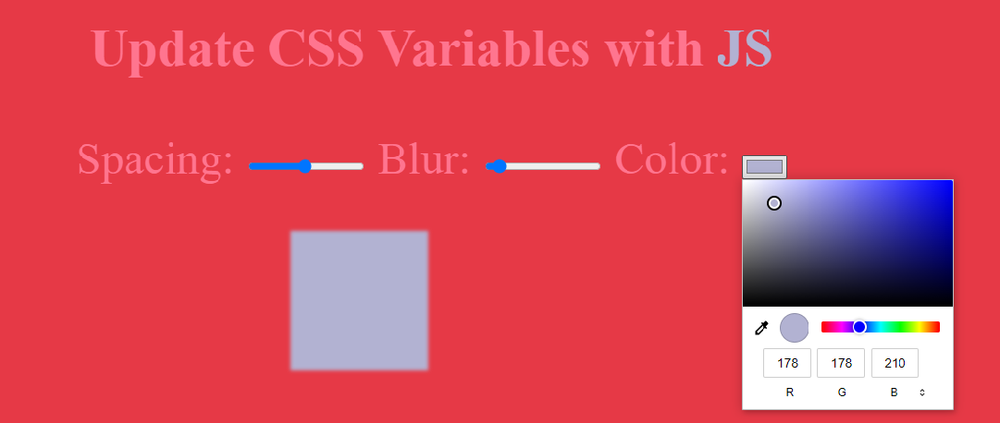

# JavaScript30-Vanilla-JS 
JavaScript30-Vanilla-JS Challenge 
* Source : [JavaScript30](https://javascript30.com/)
## 01-Drum Kit 
I avoided using `keyCode` event because this event has been deprecated. 
  
* For Other Events :point_right:  [web3school/keyboard events](https://www.w3schools.com/jsref/obj_keyboardevent.asp) 
  
Then I used the code event. For the code event, I need the code of the key that triggered the event. I chose the numbers 1,2,3..8,9. Numbers of code keys Digit 1...Digit 9. I have included these numbers. When the keys are pressed, the background changes with css and the sound specified with the same key numbers that I typed into the audio and div tag comes out.
 
<b><em>Image;</em></b>
 

## 02-Clock
There is both an analog clock and a digital clock application in this project. There are two buttons. by pressing these buttons, you can find out the time with an analog or digital clock.

## 03-CSS-Variables
There are 3 css variables in this project. The names in the input value that we have written in html and the variables that we have defined in the root that we have defined in css should be the same.
 
Like This;
 
`<input type="range" id="blur" name="blur" min="0" max="24" value="10" data-sizing="px">
:root{
    --blur:12px;
}`
 
<b><em>Image;</em></b>
 

## 04-Array-Cardio
By creating an `array`, we printed the desired value to the console using methods in these arrays.
 
* Array Methods :point_right:  [JS Arrays](https://developer.mozilla.org/en-US/docs/Web/JavaScript/Reference/Global_Objects/Array)
 

## 05-Flex Panel Gallery
In this project, we have provided the elements with the `display:flex;` property and the column property so that they come side by side. Also, with transform: translate, you can access the first child and last child of the div tags and then come to the screen with transition.

## 06-Type-Ahead
it is a program that brings the cities we enter in the input with the form element to the user via the API.

## 07-Array-Cardio-2
In This Project;  
Array Methods Used: `every` , `some` , `find` , `findIndex`.

## 08-Fun-with-HTML5-Canvas
In this project, when we can draw better with ` <input type="color">` and `<input type="number">`. that we have added to the screen with the html canvas feature, we can choose the size and color of the drawing color with the `change`event we write in JavaScript.

## 09-Dev-Tools-Domination
Different methods have been processed to print message to <em>console</em> in this project.

## 10-Hold-Shift-And-Check
First of all, we run the function with the <em>click</em> event. The operation of the content of the function is as follows: When the input is checked with the event (arr) we have sent, the console event and the message are written.

## 11-Custom-Video-Player
What this project does is we put a video with `<video>` tags where we have determined on the screen and centered it exactly on the screen with css, and the video starts playing when both the play button is pressed and the video is pressed. We did this by giving a `click event` to the video tag and the toggle in the button class.

## 12-Key-Sequence-Detection
First of all, we created an empty array and when the keys are pressed, we add elements to this array with the <em>splice method</em>. The number of elements in the Array should be as much as the number of strings we entered in <em>myCode</em>.

## 13-Slide-In-On-Scroll
With the class we gave to the img tag, I reached all the 'img tags' and gave the <b><em>transition</em></b> property. On the js side, I defined the scroll event to the window. When I scroll down with this event, the images come in animated form.

## 14-JavaScript-References-VS-Coping
the purpose of this project; Understanding the Javascript working logic. Let the value you define with let be a number, when you update this number like this;
` let number = "12"; let number1 = number; console.log(number1);`
 
number1 = 12.
 
But after this ;

` let number = 15; console.log(number1); `
 
number1 is still equal to 12.
you will see that the second value does not change. But if you update an array and change its value, the other variable you reference will also change.

## 15-LocalStorage
Here, we provide the record entry even if the page of the values ​​we entered with localStorage is refreshed.

## 16-Mouse-Move-Shadow
By setting the distance with the math object and reassigning the style to the h1 element, the desired image appears.
 

## 17-Sort-Without-Numbers
Here, with the <em>Replace</em>method, we write the expressions that we do not want to include in the order and define the expression that will replace it as a space, and we can do the sorting without the leading numbers.

## 18-Adding-Up-Time-With-Reduce
In this project, we use the reduce method to print the total duration of the data-time of the list defined as the video in the html with innerHTML. The `reduce()` method executes a function for each value of the array and eventually reduces the array to a single value.

## 19-Webcam-Fun
In this project; we use the <em>getUserMedia</em> and <em>Canvas</em> methods to capture video from a user's webcam and change the pixels.

## 20-Speech-Detection
We can print what we speak to the screen with the SpeechRecognition method.

## 21-Geolocation
In this project; with <em>navigator</em> object
A geolocation object is returned for the user's location.
The navigator object contains information about the browser.

## 22-Follow-Along-Link-Highlighter
The getBoundingClientRect() method returns the size of an element and its position relative to the viewport.
The getBoundingClientRect() method returns a DOMRect object with eight properties: left, top, right, bottom, x, y, width, height.

## 23-SpeechSynthesis
The `getVoices()` method of the <em>SpeechSynthesis</em> interface returns a list of <em>SpeechSynthesisVoice</em> objects representing all available voices on the current device. In this project, we have done the vocalization of the text we wrote to the text-area by using this method.

## 24-StickyNav
The offsetTop property returns the top position (in pixels) relative to the parent.
The returned value includes:
element's top position and margin
parent's top padding, scrollbar and border
The offsetTop property is read-only.
The element.offsetHeight read-only property returns the height of an element as an integer, including vertical padding and borders.
It opened a new tab in the nav-bar when scrolling down using these methods in the project.

## 25-Event-Capture-Propagation-Bubbling-Once
<em>Capture: </em>
A boolean value indicating that such events will be sent to the registered listener before being sent to any EventTarget below it in the DOM tree. If not specified, it defaults to false.
<em>Once </em> 
A boolean value indicating that the listener should be called at most once after it has been added. If true, the listener is automatically removed when invoked. If not specified, it defaults to false. We validated these methods with the forEach method every single div element.

## 26-Stripe-Follow-Along-Nav
First of all, we reached the size information of the element with the getBoundingClientRect method, and then we changed its properties with setProperty.

## 27-ClickAndDrag
When we went to the left with some javascript events (like mousemove) and its methods and scrollLeft, we were able to see all the elements we wrote in html with scroll on the screen.

## 28-VideoSpeedController
The Math.round() method rounds a number to the nearest integer.
Example; 
2.49 is rounded down (2) and 2.5 is rounded up (3).
In this way, we can change the speed of the video in percentiles.

## 29-CountdownTimer
The `clearInterval()` and `setInterval()` methods can count down from the specified time.

## 30-Whack-A-Mole
The image we add with the random method is randomly placed at the specified location. As soon as the user captures the image, the button click event runs and the number of clicks on the image appears on the page.